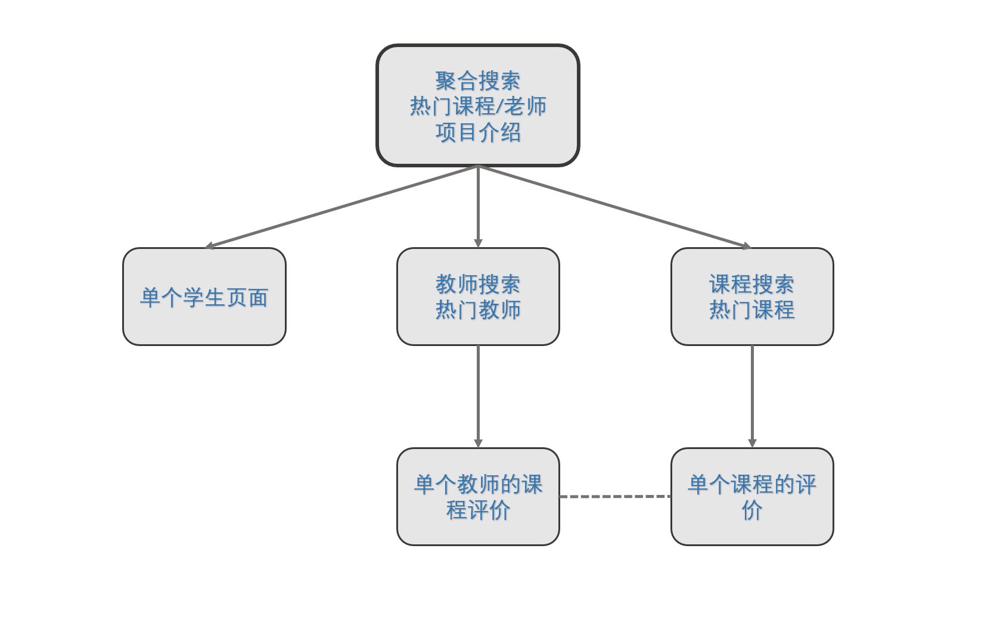

# 页面设计

## 设计思路说明

将全部的页面分为 4 类：

1. 项目主页
   1. 聚合搜索（搜索任何的课程，教师）
   2. 热门课程，教师，评价展示
   3. 项目介绍
2. 课程页面
   1. 总页面
      1. 课程搜索
      2. 热门课程展示
   2. 分页面，单个课程的评价页
3. 教师页面
   1. 总页面
   2. 分页面，单个老师开设的全部课程的评价
      1. （可能会有的）针对老师的评价（？）
4. 学生页面
   1. 不在主页提供入口，不设计专门的总页面，只为每个用户提供页面

> 设计疑问 1：我们需要为课程/教师分类设计入口页面吗？即我们需要一个页面来单独展示课程，一个页面来单独展示教师吗？
> 
> 设计疑问 2：允许对某老师进行评价吗（不与特定课程关联）？

## 效果图

